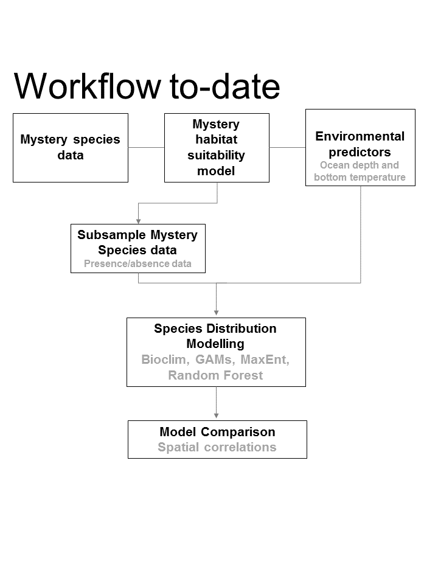

# Spatial Analysis in the Scotian Shelf Bioregion

Spatial analysis are being used to explore changes in preferred habitat of many species e.g. https://www.nefsc.noaa.gov/ecosys/spatial-analyses/
  
Habitat analysis/modeling is being explored horizontally across Science divisions in DFO. Similar questions in relation to spatial analysis are being explored using different algorithms and modelling strategies. A technical working group was formed to capitilize from this existing expertise in habitat modelling and enhance collaboration. Specifically, this group is developing this repository to compare a range of methodological approaches to conduct spatial analysis and modeling in the Scotian Shelf Bioregion. Predictions using the same data and different algorithms (i.e. Bioclim, GAM, Maxent, and Random Forest) are being explored.

***
*Approach developed so far*

  
 ***

Set up before running analysis is:
```R
1_Setup.R
```
Code used to run analysis is:
```R
2_SDM.Rmd
```
Results from code above can be visualized here:
```R
http://rpubs.com/MaritimesMSP/SDM_ScotianShelf
```
***

*Future work*  
Green boxes represent steps already completed
  
***
